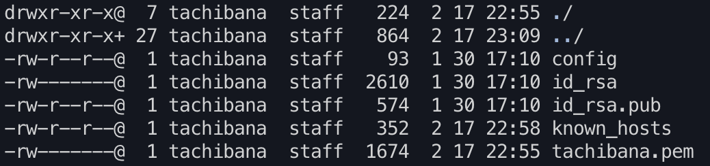

# VPC
## CIDER  
アドレスクラスの概念が無いネットワーク制御の仕組み。  
参考：[CIDER](https://wa3.i-3-i.info/word11989.html)  
 

## ルーティングテーブル
ルーターを通過するデータの次の転送先を記録したテーブル。  
AWS用語では「ルートテーブル」  
参考：[ルーティングテーブル](https://qiita.com/cafedrip/items/8f0cc9544910cba23be8)  
 

## NAT（Network Address Translation）
プライベートIPとパブリックIPを紐付けて変化する技術。  
※ただし、プライベートIP：パブリックIP＝１：１  
参考：[NAT（Network Address Translation）](https://wa3.i-3-i.info/word11978.html)  
 

## NAPT（Network Address Port Translation）
プライベートIP＋ポート番号とパブリックIPを紐付けて変化する技術。  
※プライベートIP：パブリックIP＝Ｎ：１でOK  
参考：[NAPT（Network Address Port Translation）](https://wa3.i-3-i.info/word11979.html)  
 

# Bastion
## SSH（Secure Shell）  
暗号化通信を使って外部サーバを操作するための仕組み。  
パスワード認証方式と公開鍵認証方式がある。  
接続用鍵ファイルはpem形式（.pem）であることが多い。  
参考：[SSH（Secure Shell）](https://wa3.i-3-i.info/word11722.html)  
 

## Amazon Linux  
AWSの利用に最適化されたLinuxディストリビューション。  
 

## カーネル
OSの中核処理を実行するソフトウェア。  
Linuxにおけるプロセス管理やメモリ管理等を担う。  
狭義のLinixは「Linuxカーネル」のことを指す。  
参考：[カーネル](https://qiita.com/uguis410/items/17ec1e447e9716bfdca7)  
 

## プロセス
プログラムが実行されている状態。厳密には、CPUがメモリ上のデータに対して演算を行っている状態。  
カーネルはプロセス一つ一つに対して「task_struct構造体」というデータ構造を用意し、そのtask_struct構造体に対してカーネルが操作を行うことで、プログラムを実行する。  
参考：[プロセス](https://qiita.com/uguis410/items/17ec1e447e9716bfdca7)  
 

## chmod  
Linuxのファイルやディレクトリに対してアクセス権を設定するためのコマンド。  

Linuxのファイルやフォルダにはパーミッションが設定されており、その設定を変更できる。  
  
※1文字目はファイルの種類、2文字目から4文字目はファイルの所有者に対する権限、5文字目から7文字目はファイルの所有グループに対する権限、8文字目から10文字目はその他に対する権限を表す。  

"chmod モード 対象ファイル名" という形式で実行する。  
モードには、「所有者」「所有グループ」「その他」に対して付与する権限の合計値を指定する。  
|モード（数字）  |モード（アルファベット）  |権限  |
|---|---|---|
|4  |r  |読み取り  |
|2  |w  |書き込み  |
|1  |x  |実行  |

例えば、"chmod 600 hoge.txt" を実行した場合、hoge.txtファイルに対して、「所有者」にはrw（4+2=6）、「所有グループ」「その他」には権限なし（0）を付与したことになる。  
参考：[chmod](https://qiita.com/shisama/items/5f4c4fa768642aad9e06)  
 