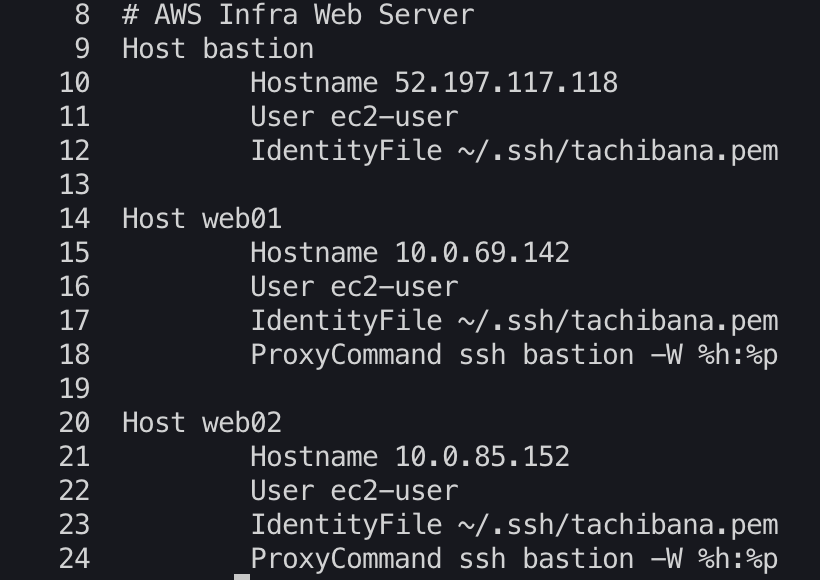

# Web Server
## 多段接続  
ssh接続先のサーバから、さらに先のサーバにssh接続する方法。  
~/.ssh/configファイルに接続情報を記載しておく。  
参考：https://dev.classmethod.jp/articles/direct-ssh-by-proxycommand/   
 

  
HOST：接続先サーバのエイリアス  
Hostname：接続先サーバのIPアドレス　※接続元から見たIPアドレス  
User：接続ユーザー  
IdentityFile：秘密鍵ファイルのパス  
ProxyCommand：接続先サーバで実行されるコマンド。"ssh [bastion server name] -W %h:%p"と指定する。※  

※実行コマンドの意味  
ssh：ssh接続の実行  
[bastion server name]：踏み台サーバのエイリアス  
-W：ホスト名とポート番号を指定するオプション  
%h：ホスト名。接続先ホスト名に置換される。  
%p：ポート番号。接続用ポート番号（デフォルトは22）に置換される。  