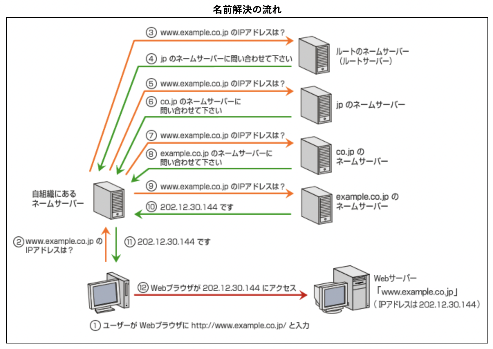
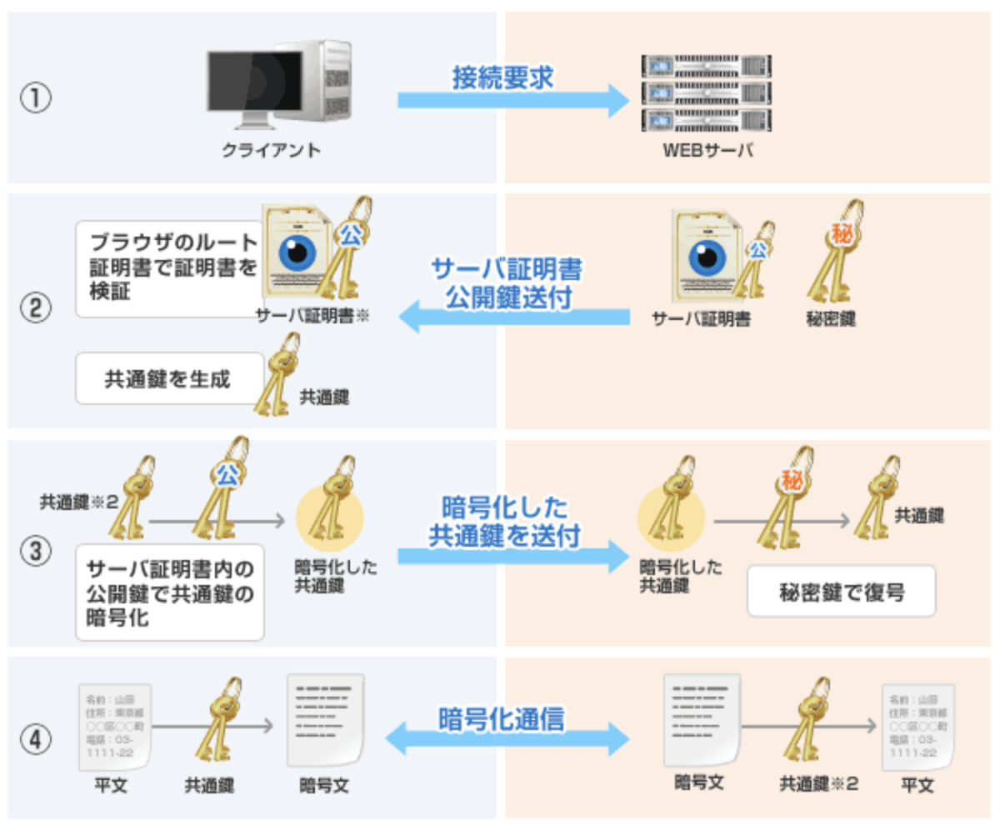

# Domain & DNS  
## ドメイン名  
ネットワーク上のサーバを人間が認識できるように、サーバのIPアドレスに対して付与された名前のこと。  
参考：[ドメイン名のしくみ](https://www.nic.ad.jp/ja/dom/system.html)  
 

## DNS（Domain Name System）  
ドメイン名とIPアドレスを対応づける仕組みのこと。  
ドメイン名からIPアドレスを引き出すことを「名前解決（正引き）」と言い、IPアドレスからドメイン名を引き出すことを「逆引き」と言う。  
DNSを利用するためには、IPアドレスとドメイン名の対応を定義する「DNSレコード」を登録する必要がある。  

参考：[ドメイン名のしくみ](https://www.nic.ad.jp/ja/dom/system.html)  
参考：[DNSレコード](https://www.fenet.jp/infla/column/server/%E3%83%AC%E3%82%B3%E3%83%BC%E3%83%89%E3%81%AE%E7%A8%AE%E9%A1%9E9%E3%81%A4%E7%B4%B9%E4%BB%8B%EF%BC%81dns%E3%81%AE%E6%A6%82%E8%A6%81%E3%82%84%E7%89%B9%E5%BE%B4%E3%81%AB%E3%81%A4%E3%81%84%E3%81%A6/)  
 

## nslookup  
ドメイン名の名前解決を行うコマンド。  
"dig" コマンドを使うとより詳細な情報を取得することができる。  
参考：[nslookupとdig](https://qiita.com/toshihirock/items/1ff01a51570bf6ca4f59)  
 

## リゾルバ  
DNSサーバに対して名前解決の要求を行うソフトウェアのこと。  
DNSサーバに対する問合せを再帰的に行い、すべてのドメイン名の名前解決を行うことができるリゾルバを「フルサービスリゾルバ」と言い、フルサービスリゾルバに対してのみ名前解決の問合せを行うリゾルバを「スタブリゾルバ」という。  
参考：[リゾルバ](https://e-words.jp/w/%E3%83%AA%E3%82%BE%E3%83%AB%E3%83%90.html)  
 

## SSL/TLS暗号化通信  
「共通鍵暗号方式」「公開鍵暗号方式」の仕組みを利用して、通信を暗号化する仕組み（プロトコル）のこと。  
クライアント側で生成した「共通鍵」を、サーバ側から送られてくる「公開鍵」を利用して暗号化し、サーバ側に送付する。  
サーバ側ではクライアント側から送られてきた「共通鍵」を自身の「秘密鍵」で復号することで、クライアントとサーバ間で「共通鍵」を用いた暗号化通信が可能になる。  
  
参考：[SSL/TLS暗号化通信の仕組み](https://jp.globalsign.com/ssl-pki-info/ssl_practices/ssl_encryption.html)  
 

## SSLサーバ証明書  
Webサイトの実在性を証明するための電子証明書。  
サイト運営者の情報やSSLサーバ証明書の発行者の情報の他に、SSL/TLS暗号化通信を行うための鍵の情報も含まれる。  
参考：[SSLサーバ証明書とは](https://jp.globalsign.com/ssl-pki-info/ssl_beginner/sslcerts.html)  
 

## ルート証明書  
ルート認証局が、自身の正当性を証明するために発行した自己署名の電子証明書のこと。  
公開鍵暗号を利用するソフトウェアに組み込んでおき、中間認証局の証明書から組み込まれたルート証明書にたどり着けるかどうかを検証することで、通信の安全性を担保することが出来る。  
※このような社会的基盤のことをPKI（Public Key Infrastructure/公開鍵基盤）と言う
参考：[ルート証明書とは](https://e-words.jp/w/%E3%83%AB%E3%83%BC%E3%83%88%E8%A8%BC%E6%98%8E%E6%9B%B8.html)  
 
