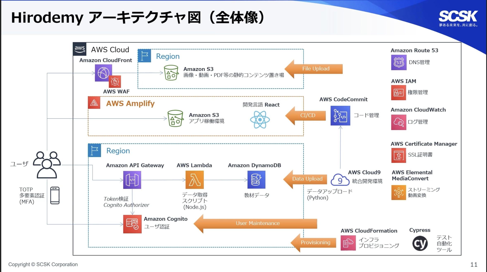

# 2021/05/11
## タイトル
インフラエンジニアだけでサービス開発してみた ～フルスタックエンジニア育成への取り組み～  
 

## 日時
2021/05/11 14:45 - 15:15  
 

## 発表者
SCSK 広野様  
 

## 内容
- 実現したこと
  - 社内のインフラエンジニアを集めてAWS学用の社内サイトを構築
  - e-learningサイトの簡易版
  - 社内セミナーの動画共有
  - AWS Amplify + React（モダンWebアプリケーション）
- アーキテクチャ

  - AWS Amplify：CI/CDパイプライン＋Webアプリホスト
    - ブラウザ操作のテスト自動化ツールを組み込む
- 開発方法
  - 「サービス開発実践研修」を企画し、社員がエントリー
  - DevOpsで開発
  - 2ヶ月でサービス開発を実施（業務の傍らでの実施）
- なぜインフラエンジニアが短期間でサービスを開発・リリースできたか？
  - 手戻りの発生抑止
    - Amazon Working Backwords：Amazonのサービスデザイン手法。
    - 「サービスが提供する価値」をプレスリリース形式にまとめることで、サービス開発の要件を整理する。
  - 開発労力の削減
    - クラウドネイティブでの開発。
    - AWSソリューションアーキテクトによるレビューを実施。
  - 自己学習モチベーションの維持
    - 「おもしろい」「たのしい」
 

---

## タイトル
はじめて学ぶ「クラウドネイティブな運用設計」とは  
 

## 日時
2021/05/11 17:45 - 18:15  
 

## 発表者
NTT東日本　白鳥様  
 

## 内容
- Introduction
  - NTT東日本はAWS Slution Providor（AWS Advanced Consulting Partner）
  - AWSアカウントのリセールやコンサル、運用保守も担当
  - インフラ構築や維持管理を巻き取る戦略
- 運用業務のクラウド移行とは？
  - 「クラウドに移行すれば運用はクラウド業者がやってくれる」はNG
    - "Design for Fail"の設計が重要
    - 継続的なサービス提供の方法を検討する必要がある
  - これまでの運用業務はなんのためにやっていたか？に立ち返ること（業務運用の目的は？）
- クラウドネイティブな運用業務とは？
  - クラウド設計の原則（Well-Architected Framework）：AWSのベストプラクティス集
  - 組織・準備・運用・進化の４つの観点で考えてみる
  - どのようなメトリクスを収集し、どのような監視を行うか？
    - ビジネスKPI・ユーザ目線で監視対象を決定する
    - アラートは必要最小限に
  - 常に運用業務の改善活動を
    - 改善機会の用意・対応策の検討と実施・文書化しての共有
    - メトリクスのしきい値を最適な値に維持すること
- まとめ
  - 設計段階からシステム運用を考慮に入れましょう