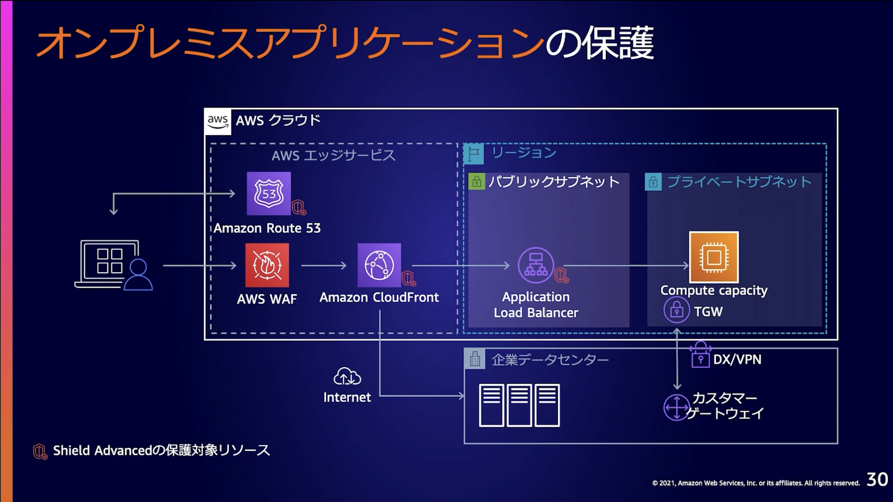

# 2021/05/12
## タイトル
AWSにおける安全なWebアプリケーションの作り方  
 

## 日時
2021/05/12 12:30 - 13:00  
 

## 発表者
AWSジャパン 技術統括本部 ソリューションアーキテクト 保里様  
 

## 内容
-  Webアプリの静寂性とセキュリティガイドライン
   -  Webアプリの脆弱性対策は開発者の責任（「責任共有モデル」）
   -  セキュリティガイドライン
      -  IPA発行「安全なウェブサイトの作り方」
      -  OWASP Top10
-  Webアプリのセキュリティ対策
   -  認証・認可のセキュリティ
      -  IAMユーザーのキーをプログラムに埋め込まず、IAM Rokeのメタデータを利用する
      -  なるべく既存の仕組みを利用する（独自実装しない）
      -  アプリの特性に応じて認証・認可の方法を判断する
         -  Amazon Cognito, AWS SSO, IDaaS
      -  Amazon Cognito
         -  ユーザープール：一時的なトークンの払い出し（認証）
         -  IDプール：一時的なクレデンシャルの発行（認可）
      -  認証情報はセキュアな外部に保存する
         -  AWS Systems Manager Parameter Store, AWS Secrets Manager, Lambda環境変数
   -  実装のセキュリティ
      -  アプリケーションフレームワークで用意されている機能を正しく利用する（独自実装しない）
   -  ログの取得とモニタリング
      -  フレームワークのログはきちんと出力する
   -  コードレビュー
      -  コーディング規約を策定すること
      -  Linterを利用する
   -  セキュリティテスト
      -  SAST（コードを動かさず、ソースコードを解析することによるセキュリティテスト）
         -  Amazon CodeGru Revier Security Detector
         -  GitHub Code Scanning
      -  DAST（動いているソースをスキャンすることで行うセキュリティテスト）
         -  OWASP ZAP
   -  WAFによる保護
      -  補足的なセキュリティ対策に有効（被害の緩和）
         -  AWS WAF
         -  AWS WAFのマネージドルールも利用する
   -  継続的なセキュリティテスト/脆弱性診断
      -  アプリケーションが変更されるたびにテストを実施すること
      -  DevSecOps：DevOpsのパイプラインにセキュリティテストを組み込む
      
-  まとめ  

---

## タイトル
AWSにおけるネットワーク＆アプリケーション保護のすすめ  
 

## 日時
2021/05/12 13:15 - 13:45  
 

## 発表者
AWSジャパン 技術統括本部 レディネスソリューション本部 セキュリティソリューションアーキテクト 中島様  
 

## 内容
- はじめに
  - AWSのセキュリティ対策
  
- 境界防御
  - AWS Network Firewall
    - AWSのマネージドサービスとしてのFirewall
    - 通信の中身（ペイロード）を検査しての保護も可能
    - ネットワークトラフィックの量に応じて自動でスケールアウト
    
  - AWS WAF
    - 既存の構成にアタッチするだけで利用可能
    - AWSマネージドルールを提供（ベースラインとしての防御）
  - AWS Shield Standard / Advanced
    - DOS攻撃を検知し遮断する
- 要件に応じた設計（デザインパターン）
  - 一般的なWebアプリケーションの保護
  
  - サーバレスアプリケーションの保護
  
  - 遅延にセンシティブなアプリケーションの保護
  
  - オンプレミスアプリケーションの保護
  
- 運用をスケールさせる
  - AWS Firewall Manager
    - AWS Network Firewall, AWS Shield Advanced, AWS WAF, VPC Security Groupを一元管理
    - ポリシーを定義し、乖離した場合に実行するアクションを定義する
    - AWS Organizationの利用が前提
- まとめ

---

## タイトル
AWSで始めるInfrastructure as Code  
 

## 日時
2021/05/12 14:00 - 14:30  
 

## 発表者
AWSジャパン 技術統括本部 技術推進本部 テクニカルソリューション部 ソリューションアーキテクト 木村様  
 

## 内容
- AWS環境におけるコード管理とは
  - アプリケーションとリソースを同じLifeCyCleで管理できる
  - デプロイするためのテンプレートスタック＝リソースの集合体を定義しておく
    - 複製・再デプロイ・再使用が可能
    - 手作業での修正を抑制
  - コード管理の目的は？
- AWS CloudFormationで行うコード管理
  - テンプレート：リソースを定義、チェンジセット：影響範囲の確認、スタック：リソースの集合体
  - Former2（3rd Party製品）を利用することで、既存の環境をCloudFormationテンプレート化できる
    - YAML形式やJSON形式
  - テンプレートが巨大化してきた場合はレイヤ（フロントエンド ~ 認証・認可）ごとに分割する
    - 「クロススタック参照」を利用することで、スタックをまたいだ値の参照を設定できる
  - 機密情報はAWS Secrets Manager等で管理すること
- AWS CDKで行うコード管理
  - AWSの環境構成をプログラミング言語のような形で記述できる（TypeScript, JavaScript, Pyton, Java, C#）
  
  - 指定しない値はAWSのデフォルト設定が適用される
  - 内部的にはCloudFormationのテンプレートが生成されて実行される
  - L1 ~ L3Construct
- コード管理の注意点
  - 100%を目指さない
  - 巨大化させず、適切なサイズに分割する
  - 状況に応じてコード化の要否を判断する
- 何から始めるか？
  - 「AWS ハンズオン」でAWS環境のコード管理を学習

---

## タイトル
情報教育分野におけるクラウド対応の現状とこれからの情報教育プラットフォーム  
 

## 日時
2021/05/12 14:45 - 15:15  
 

## 発表者
ライフイズテック株式会社 サービス開発本部 チーフテクノロジスト/サービス開発本部長 奥苑様  
 

## 内容
- プログラミング教育の流れ
  - 2020年：小学校でのプログラミング教育必修化
  - 2021年：技術・家庭科でプログラミング教育実施
  - 2022年：「情報I」の必修化
  - 2024年：大学入試に「情報」の追加？
- 情報セキュリティガイドラインの改定
  - クラウドへの対応：クラウド活用に関するガイドラインの追加
  - 「情報セキュリティ対策基準」の格下げ：対策基準が参考情報となった
- 基本的なセキュリティポリシーへの対応
  - 組織的対策：トレサビの確保
  - 物理的対策：AWSクラウドでの環境構築（ISMS準拠のアーキテクチャ）
  - 技術的対策：セキュリティ対策
- 日本法準拠への変更対応
  - 紛争発生時に日本法に基づいた裁判をできるようにする
- 教育とAWSとの親和性
  - ID Federation
  
  - 制御されたPaaS環境
    - AWS Cloud9：利用言語がセットアップされたEditor
    - Amazon RDS：必要なデータをあらかじめ準備しておく
