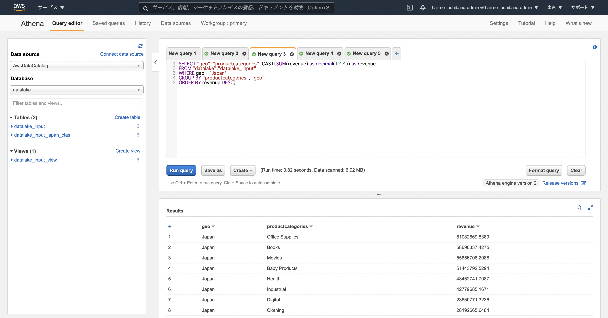

# 第7章　サーバレスSQLによるデータ分析  
- Amazon Athena  
    
 

---
 

# 第8章　データを変換する
- (なし)  
 

---
 

# Memo
- クローリング  
  クローリングとは、ロボット型検索エンジンにおいて、プログラムがインターネット上のリンクを辿ってWebサイトを巡回し、Webページ上の情報を複製・保存することである。  
  クローリングを行うためのプログラムは特に「クローラ」あるいは「スパイダー」と呼ばれている。  
  参考：[クローリング](https://www.weblio.jp/content/crawling)  