# Data Warehouse Fundamentals for Beginners
## Link
[Data Warehouse Fundamentals for Beginners](https://nssol.udemy.com/course/data-warehouse-fundamentals-for-beginners/learn/lecture/17728676)  
 

## 講師
Alan Simon  
 

## 内容
## Section 3 : Data Warehousing Architecture
- Data Warehouseのパターン  
  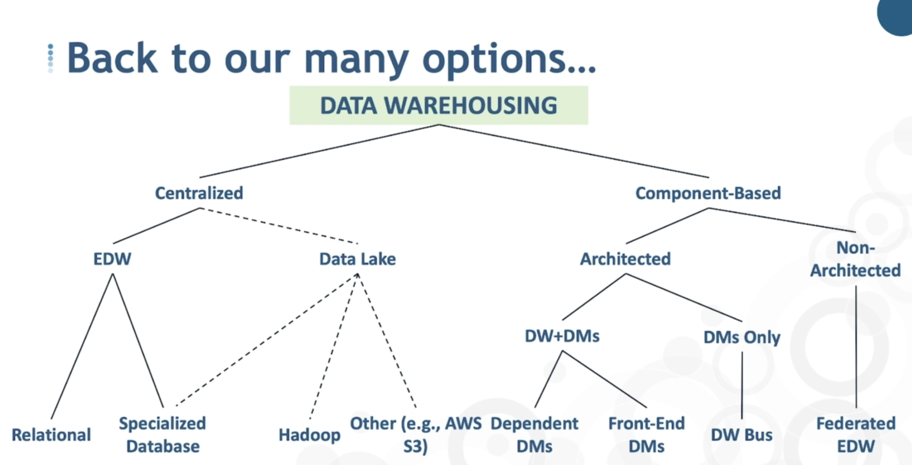  

- Cube  
  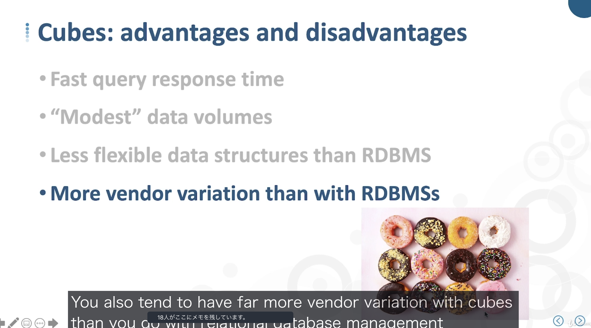  

- ODS(Operational Data Store)  
  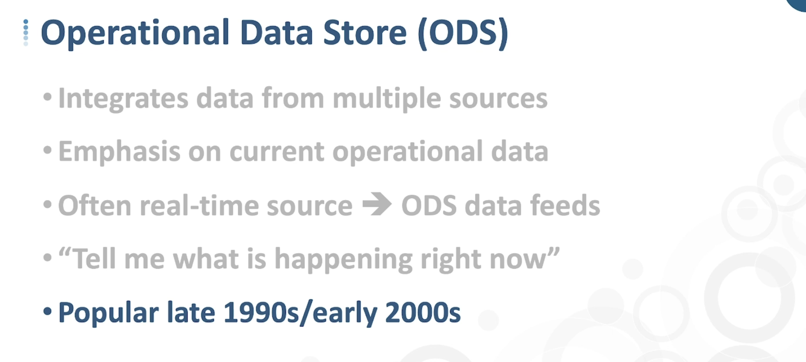  

- Data Warehouse Staging Layer  
  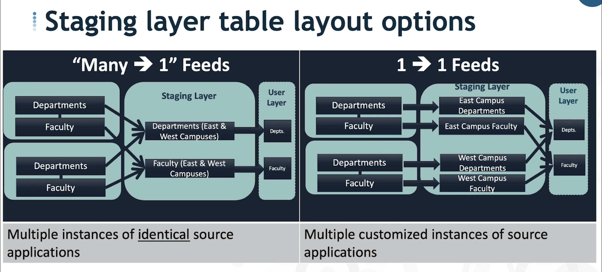  
 

## Section 4 : Bring Data Into Your Data Warehouse  
- ETL Transformation Models  
  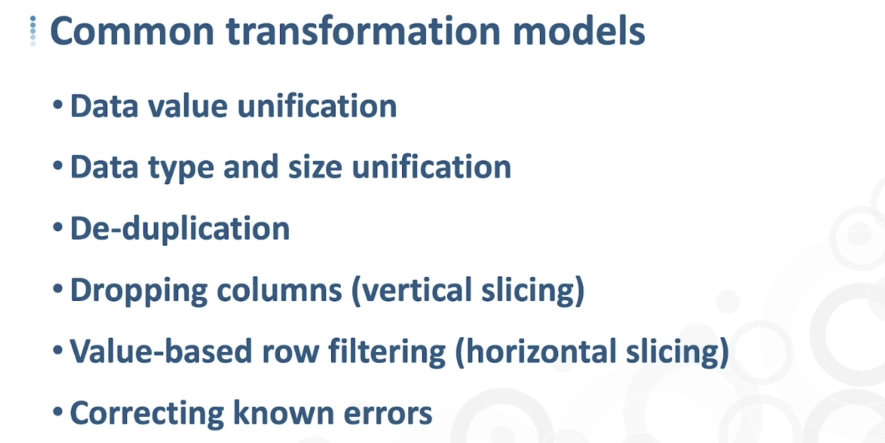  
  - Data Value Unification：値の統一（コード変換など）
  - Data Type and Size Unification：データ型・データ桁数の統一
  - De-duplication：重複データの排除
  - Dropping Columns (vertical slicing)：不要カラムの削除（分析に使わないカラムの排除）
  - Value-based Row Filtering (horizontal slicing)：不要データの削除（分析に使わないデータの排除）
  - Correcting Known Errors：データクレンジング（不適切なデータの修正）  
 

## Section 5 : Data Warehousing Design: Building Blocks  
- Star Schema vs. Snowflake Schema
  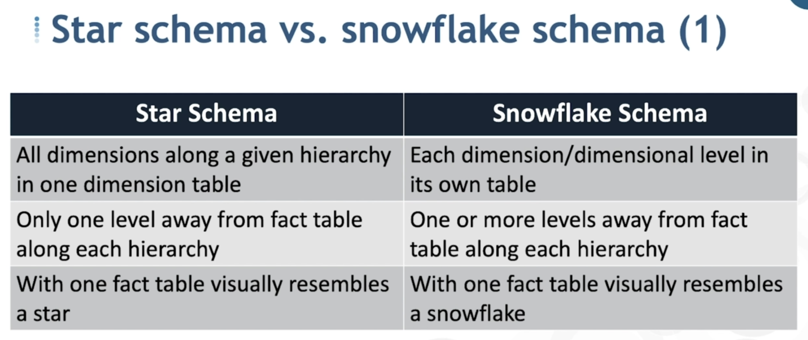  
  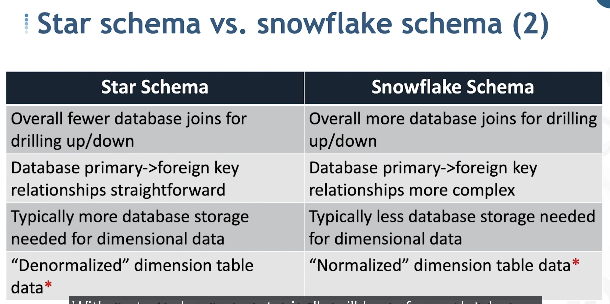  
  - Star SchemaもSnowflake Schemaも元データの次元は同じ。  
  （例：製品ファミリー 1..N 製品カテゴリー 1..N 製品名）
    - Star Schema：製品ファミリー・製品カテゴリー・製品名をすべて同じテーブルに持つ（正規化を崩す）  
    - Snowflake Schema：製品ファミリー・製品カテゴリー・製品名はそれぞれ別のテーブルで持つ（正規化を残す）  
  
- Data Warehouseing and Natural Keys  
  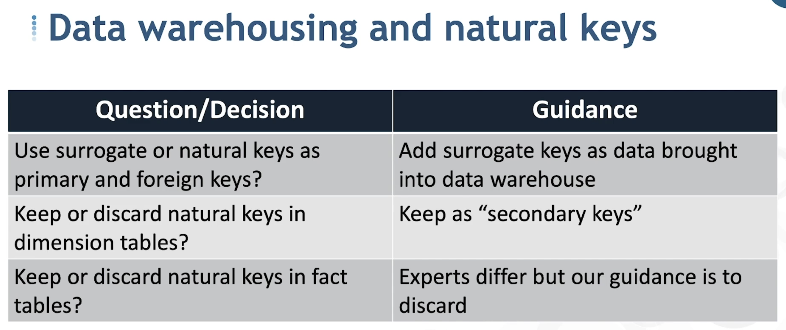  

- Foundational Conepts
    
 

## Section 6 : Design Facts, Fact Tables, Dimensions, and Dimension Tables  
- Snowflake Schema PK-FK Rules
  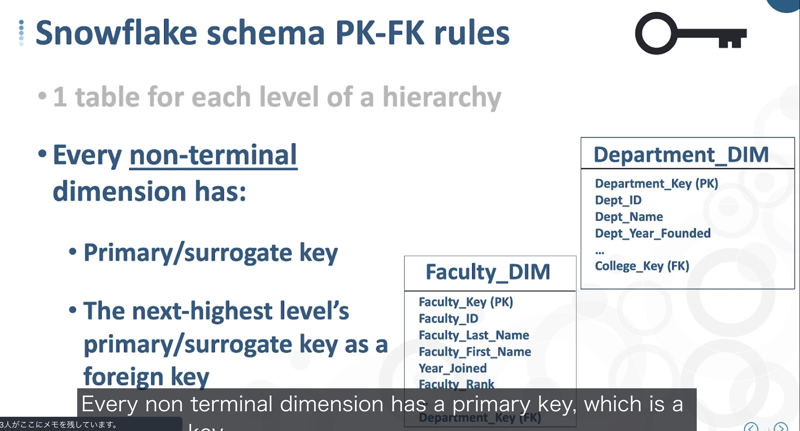  
  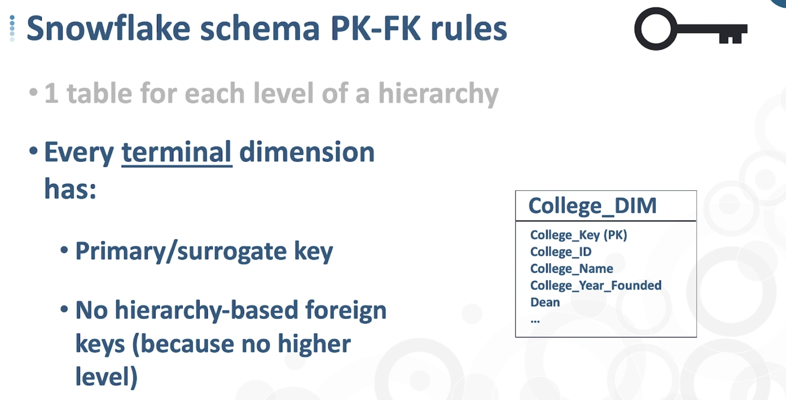  

  - Fact TableとDimension TableのRelationはSurrogate Keyを使って定義する。  
  - Fact Tableが持つNatural Keyを使えばレコードを一意に特定することはできるが、Dimension TableheへのForeign Keyとしては利用しない。  
  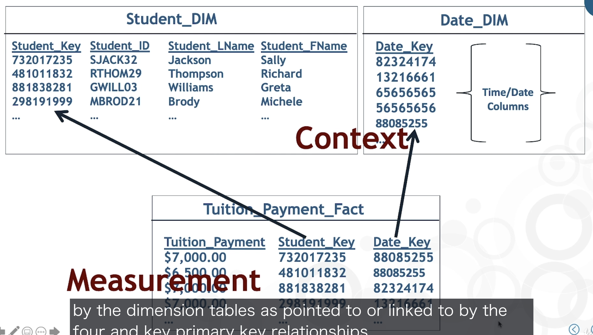

- Fact Table Types
  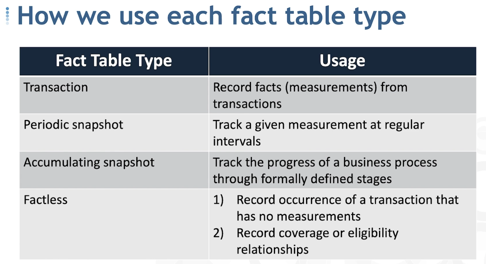  

  - Transaction：特定のトランザクションを管理する（授業料支払トランザクションなど）
  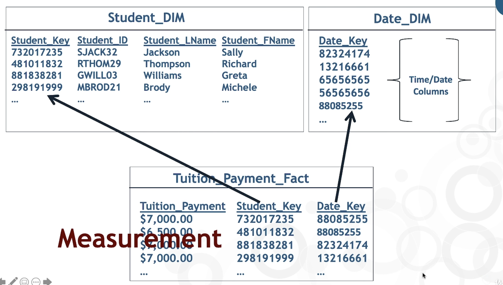  
  - Periodic Snapshot：トランザクションの定期的な履歴を管理する（毎週のミールカード利用履歴など）
  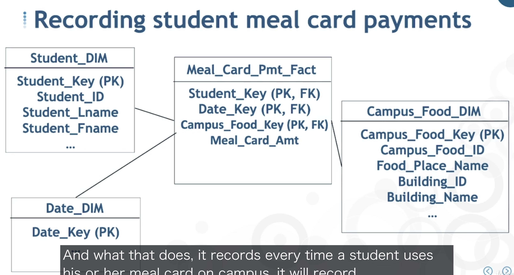  
  - Accumulation Snapshot：あるトランザクションの時間軸での変化を管理する（奨学金審査の進捗状況など）
  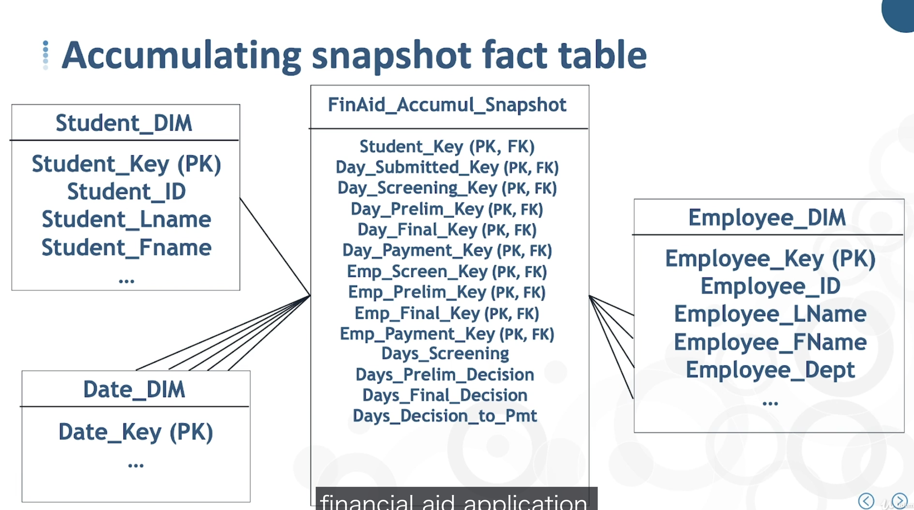  
  - Factless：
