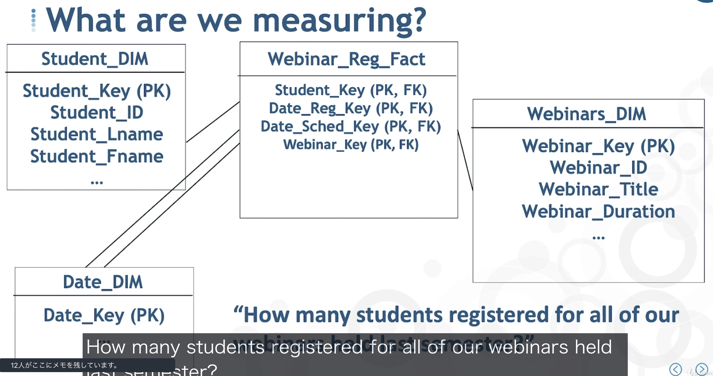
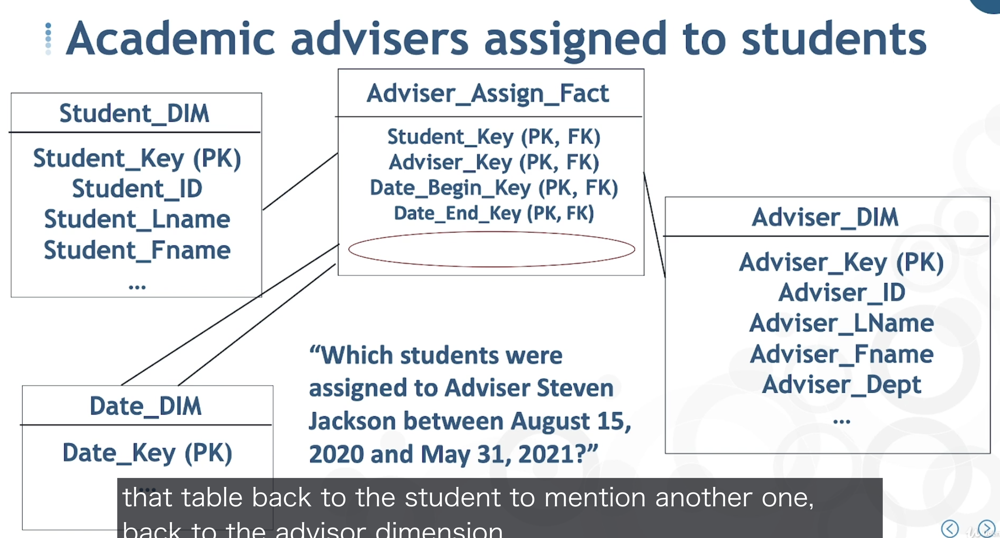
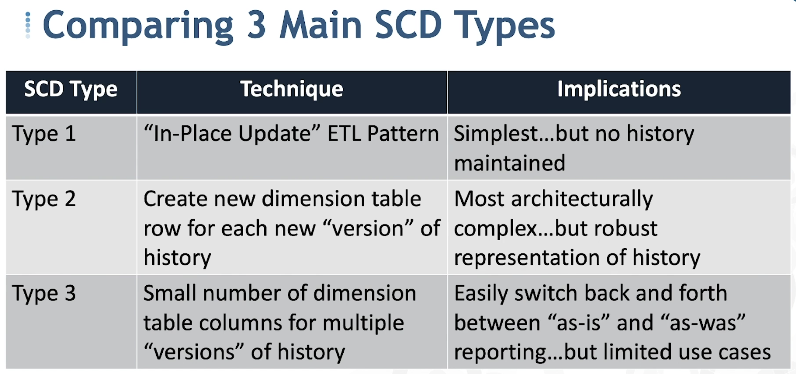
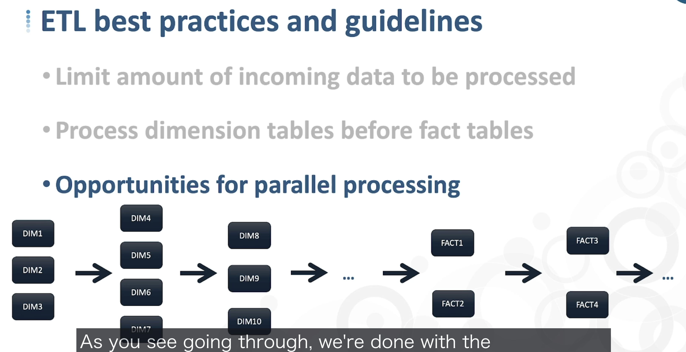

# Data Warehouse Fundamentals for Beginners
## Link
[Data Warehouse Fundamentals for Beginners](https://nssol.udemy.com/course/data-warehouse-fundamentals-for-beginners/learn/lecture/17728676)  
 

## 講師
Alan Simon  
 

## 内容
## Section 3 : Data Warehousing Architecture
- Data Warehouseのパターン  
    

- Cube  
    

- ODS(Operational Data Store)  
    

- Data Warehouse Staging Layer  
    
 

## Section 4 : Bring Data Into Your Data Warehouse  
- ETL Transformation Models  
    
  - Data Value Unification：値の統一（コード変換など）
  - Data Type and Size Unification：データ型・データ桁数の統一
  - De-duplication：重複データの排除
  - Dropping Columns (vertical slicing)：不要カラムの削除（分析に使わないカラムの排除）
  - Value-based Row Filtering (horizontal slicing)：不要データの削除（分析に使わないデータの排除）
  - Correcting Known Errors：データクレンジング（不適切なデータの修正）  
 

## Section 5 : Data Warehousing Design: Building Blocks  
- Star Schema vs. Snowflake Schema
    
    
  - Star SchemaもSnowflake Schemaも元データの次元は同じ。  
  （例：製品ファミリー 1..N 製品カテゴリー 1..N 製品名）
    - Star Schema：製品ファミリー・製品カテゴリー・製品名をすべて同じテーブルに持つ（正規化を崩す）  
    - Snowflake Schema：製品ファミリー・製品カテゴリー・製品名はそれぞれ別のテーブルで持つ（正規化を残す）  
  
- Data Warehouseing and Natural Keys  
    

- Foundational Conepts
    
 

## Section 6 : Design Facts, Fact Tables, Dimensions, and Dimension Tables  
- Snowflake Schema PK-FK Rules
    
    

  - Fact TableとDimension TableのRelationはSurrogate Keyを使って定義する。  
  - Fact Tableが持つNatural Keyを使えばレコードを一意に特定することはできるが、Dimension TableheへのForeign Keyとしては利用しない。  
    - Surrogate KeyをPKとして使っておけば、Type 2(後述)のデータ履歴管理がしやすくなる。  
  

- Fact Table Types
    

  - Transaction：特定のトランザクションを管理する（授業料支払トランザクションなど）
    
  - Periodic Snapshot：トランザクションの定期的な履歴を管理する（毎週のミールカード利用履歴など）
    
  - Accumulation Snapshot：あるトランザクションの時間軸での変化を管理する（奨学金審査の進捗状況など）
    
  - Factless(1)：集計データを持たないトランザクションを管理する（ウェビナーの受講記録など）
    
  - Factless(2)：トランザクションが無いディメンション同士の関係を管理する（学生アドバンザーのアサイン履歴など）
    
 

## Section 7 : Managing Data Warehouse History Through Slowly Changing Dimensions  
- Slowly Changing Dimentions(SCDs)  
  - Data Warehouse内でのデータ履歴管理の考え方  
    

  - Type 1：古いデータを新しいデータで上書きする履歴管理方式
    - データの履歴を保持する必要が無い場合に利用（エラーデータを修正する場合など）
    - ただデータをUpdateすればよいので、アーキテクチャが最もシンプル。
  - Type 2：新しいレコードを新たな行として追加する履歴管理方式
    - 複数行のデータを履歴として保持する必要がある場合に利用（学生の転居履歴を管理する場合など）
    - Effective Date（有効開始日）, Expiration Date（有効終了日）, Current Flag（有効フラグ）を持たせることで、現在どのデータが有効かを管理することができる。
  - Type 3：新旧のデータを別の列で管理する履歴管理方式
    - 新旧のデータを同一行で管理したい場合に利用（支店統合前後の従業員の所属店舗情報を管理する場合など）
    - Current Value（新データ）とOld Value（旧データ）を同一行に保持することで、新旧どちらの切り口でデータを分析する場合にも対応しやすい。  
 

## Section 8 : Designing Your ETL  
- ETL best practices and guidelines  
    
- 変更データ追跡のテクニック  
  - タイムスタンプ比較：データのタイムスタンプが前回のETL実行時間以降のものを連携する  
  - データベースログ：データベースのログを参照し、前回のETL実行時間以降の変更を連携する  
  - データベーススキャン：データベースとDWHの全データをスキャンし、差分を抽出して連携する  
 
