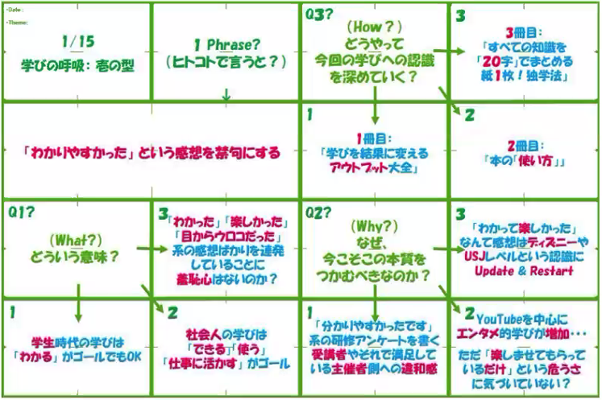
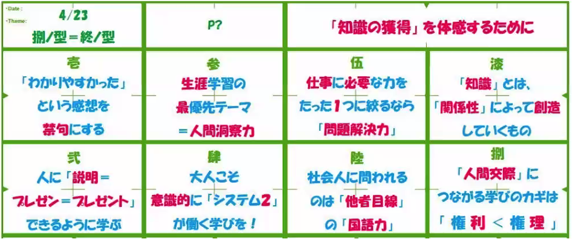

# 2021/05/24　flier book laboオープントークセッション
## タイトル
『紙1枚！仕事に活かす学び型』〜大人にこそ必要な学びのあり方とは～  
 

## 日時
2021/05/24 12:00 - 12:45  
 

## イベントサイト
https://0524flierbooklabo.peatix.com/  
 

## 発表者
ゲストスピーカー：浅田 すぐる  
ファシリテーター：荒木 博行  
 

## 内容
### flier book laboでの音声配信を振り返って
- 本を紹介するだけではなく、本の内容を活かせる学びを提供する  
 

### 「紙１枚!」の作り方・見方
- 学び方  
  
- 言葉を丸めない  
  - 多くの人に当たり障りのない言葉にするのではなく、本質を射抜く言葉を選択する  
- １枚のスタイル  
  - スペースの制約があることで言葉を吟味するようになる  
 

### 学びの本質
- 学びの本質  
    
- 学生の学びと社会人の学び
  - 社会人の学びには「他者」が登場する
  - 「他者」の役に立つかどうか？を意識した学びを  
  - 20字まとめは「他者」に説明するため  
  - 自分のための独学 → 他者のための独学  
- なんのために仕事をしている？
  - そこに「他者」は出てくるか？
    - 「価値貢献の相手の他者」と「競争相手の他者」
    - 仕事の本質は「価値貢献の相手の他者」
- 他者貢献の学び
    - 「わかりやすかった」は自己完結の学びでしかない
      - Pay Forwardの学びを
    - 『知識創造企業』野中郁次郎＋竹内弘高
      - 知識とは「関係性」によって創造されるものである
      - 自分一人では知識は創造できない
      - 自分の中で陳腐化していく知識を他者との関わりの中でアップデートしていく
