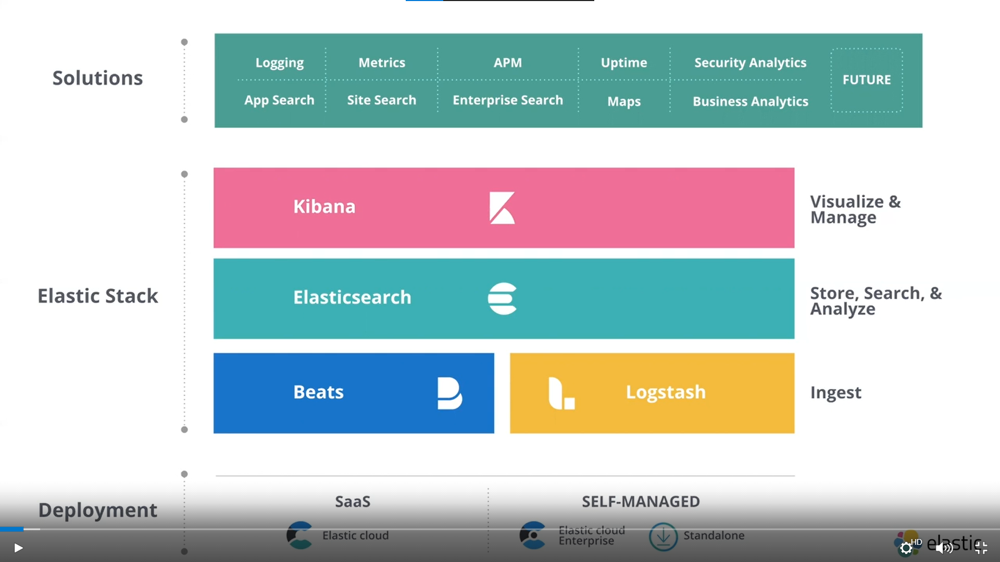
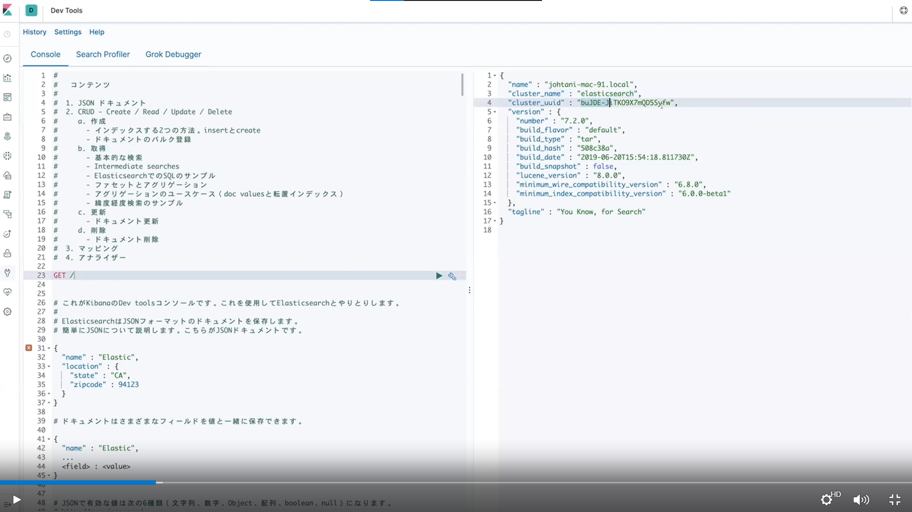
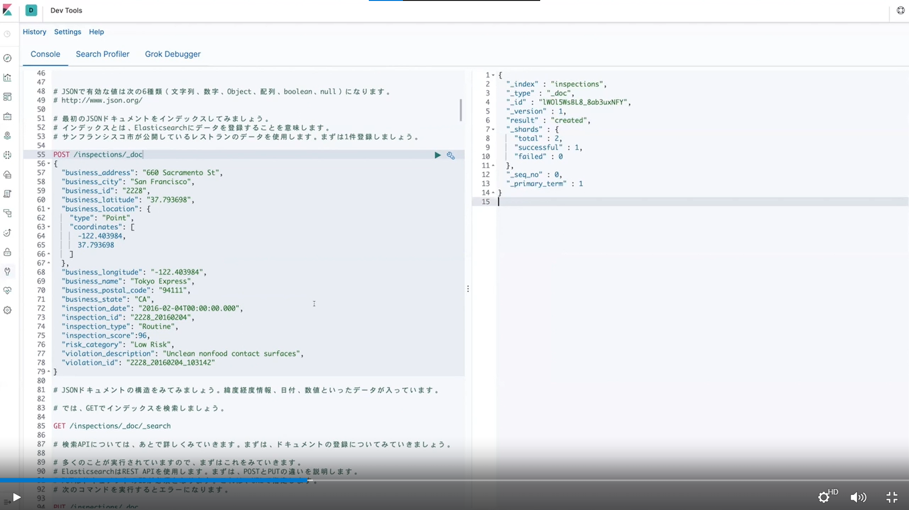
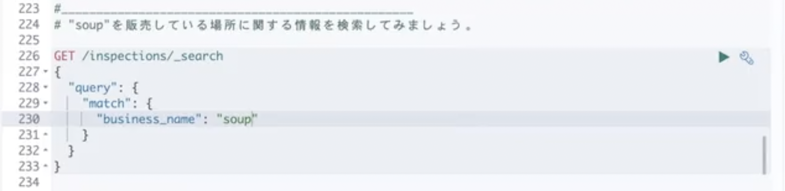
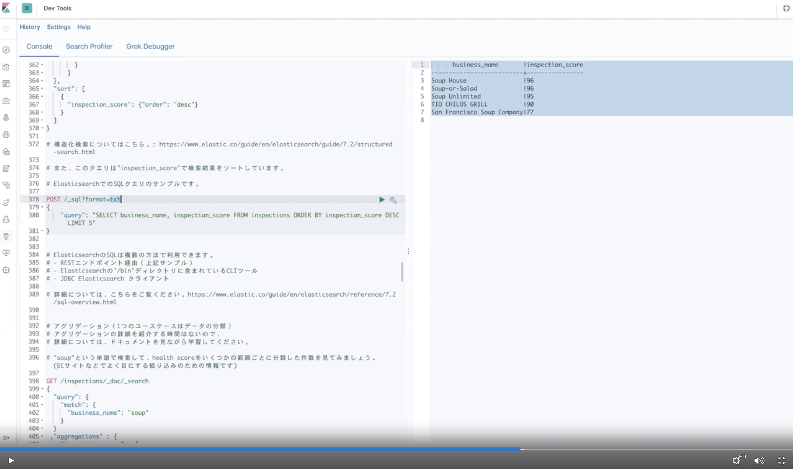
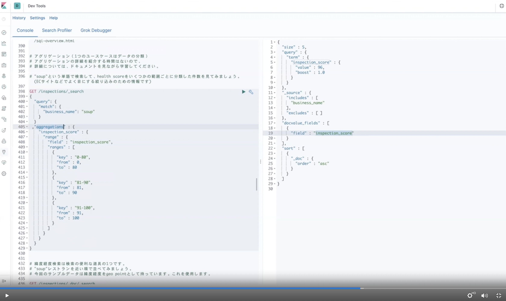
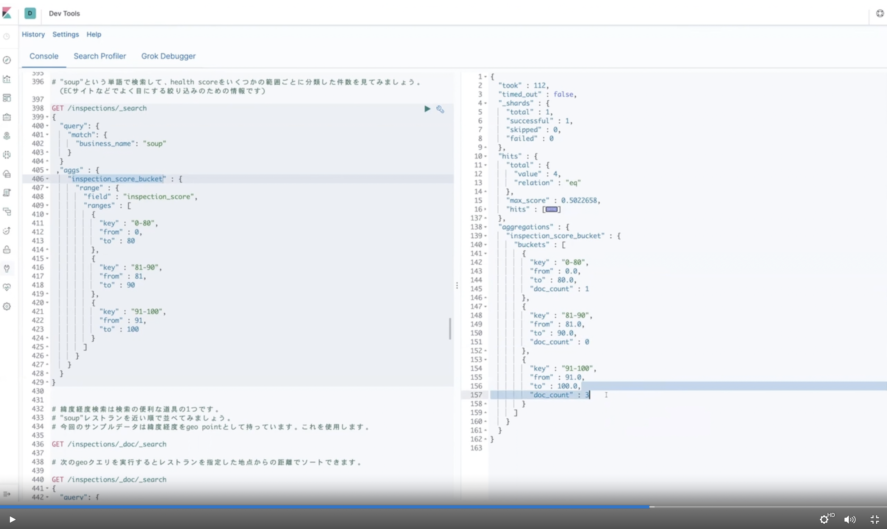

# 2021/07/15　Elasticsearch入門
## タイトル
Elasticsearch入門  
 

## サイト
https://www.elastic.co/jp/webinars/getting-started-elasticsearch  
 

## 主催者
Jun Ohtani  
 

## 内容
- Elastic Stack  
  
 

- Kibana Dev Tools
  - Elasticsearchへの接続を簡単に行うことができるツール  
    
 

- Elasticsearch Security  
  - Elasticsearch内部の通信（ノード間通信）やElasticsearchと外部との通信をTLSで行うことができる  
  - "Elasticsearch.yml"ファイルに設定を記述することで有効化できる  
  - ログインユーザの設定はコマンドで行う。その際、ランダムパスワード生成/任意パスワード設定が可能  
    - "Kibana.yml"にユーザ/パスワード情報の追記が必要  
    - "kibana-keystore"を使うと"Kibana.yml"に直接ユーザ/パスワードの情報を書かなくてもよい  
    - Kibanaの中にもユーザ/パスワード設定画面がある  
    - Kibanaで定義されているロールをユーザに割り当てることで、RBACが可能  
 

- Elasticsearchの使い方  
  - インデックス：Elasticsearchで実際にデータが保存される場所のこと  
    - データ登録時に存在しないインデックスを指定した場合は自動生成される  
    - PUTコマンドを使って明示的にインデックスを作成することもできる  
    - インデックスの情報は"GET /<インデックス名>/_settings"で参照できる  
  - マッピング：インデックスの各項目の型桁情報（ドキュメントの構造）を定義する  
    - 型桁の変更はできないので、変更する時は一度インデックスを削除して再作成する  
    - reindex APIを使うと、既存のインデックスから新しいインデックスにデータをコピーできる  
    - インデックスへの項目追加は_updateエンドポイントであとからでも実行できる  
  - _doc：データを登録する時の「おまじない」　※Elasticsearch 8では削除される予定  
  - POSTコマンド＋JSON形式のデータを指定することで、データを登録する  
  - データの登録結果がJSON形式のレスポンスで返ってくる  
  
  - GETコマンドでデータを検索する  
    - 例）GET /inspectios/_doc/_search  
    - Elasticsearch 7以降は"_doc"は無くてもよい  
    - 特定の条件にマッチするドキュメントを検索する場合は、matchクエリを使う  
      
    - フレーズ検索はmatch_phraseクエリ  
    - 検索結果は検索条件との関連度（relevance）の降順にソートされる  
    - 条件検索にはboolクエリを使う  
      - AND条件はmustクエリ・AND NOT条件否定はmust_notクエリ・OR条件はshouldクエリ  
    - boostクエリを使うことで関連度（relevance）に重みづけすることができる  
    - 範囲検索はrangeクエリを使う  
      - デフォルトではソート順はランダムになる  
      - sortオプションを使って特定フィールドの昇順/降順検索ができる  
  - PUTコマンド＋JSON形式のデータを指定することで、データを登録する  
    - Elasticsearchでデータを管理するためのIDを明示的に指定できる  
    - POSTで登録した場合はIDが自動採番されて登録される  
- 大量データの登録にはBulk APIが利用できる  
  - PUT /<インデックス名>/_doc/_bulk  
  - index+JSONデータの形式で複数データを登録できる  
    
  - Bulk AIPで登録したデータのエラー有無は戻り値のJSONの"errors"でチェックする（true/false）  
- Elasticsearch 7以上では、10,000件以上データがある場合はTop 10,000件しか返って来ない仕様となっている  
  - 全件返却が必要な場合は、"track_total_hits"という設定をtrueにする  
- クエリにはSQLも利用できる
    
  - POST /_sql?format=txt  
  - format=csv とすると、CSV形式でデータが返ってくる  
  - /_sql/transration を実行すると、SQL文をErasticsearchの検索構文に変換してくれる  
- アグリゲート機能を利用すると、分析結果を集計できる  
  - aggregations（aggs）オプションを利用する  
    
    
- 緯度経度を使ってある地点から近い順にソートすることができる  
  - geo_point型を使う  
- データの更新・
  - データを更新すると、内部的にはレコードの論理削除と追加が行われてドキュメントのバージョンが上がる  
  - データ削除はDELETEコマンドで行う。削除されるとレコードは論理削除されてドキュメントのバージョンが上がる  
  - ただし、過去バージョンの取り出しやロールバックはできないので注意  
- アナライザー（Analyzers）  
  - 検索速度を向上させるための「転置インデックス」を作成する  
  - 入力された文字列を単語分割して作成される  
  - analyzeエンドポイントを使うと、どのように文字列分析されているかが分かる  
    - standardトークナイザー：文字列をスペースもしくは区切り文字で分割する  
    - whitespaceトークナイザー：文字列をスペースで分割する  
    - トークンフィルターを使うことで、転置インデックスの作成のされ方を制御できる（大文字と小文字を同一語として扱う など）  
    - kuromojiプラグインを使うと、日本語のトークナイズもできる  
      - kuromojiは内部で辞書を持っており、もっともらしい日本語の区切り方で単語分割される  