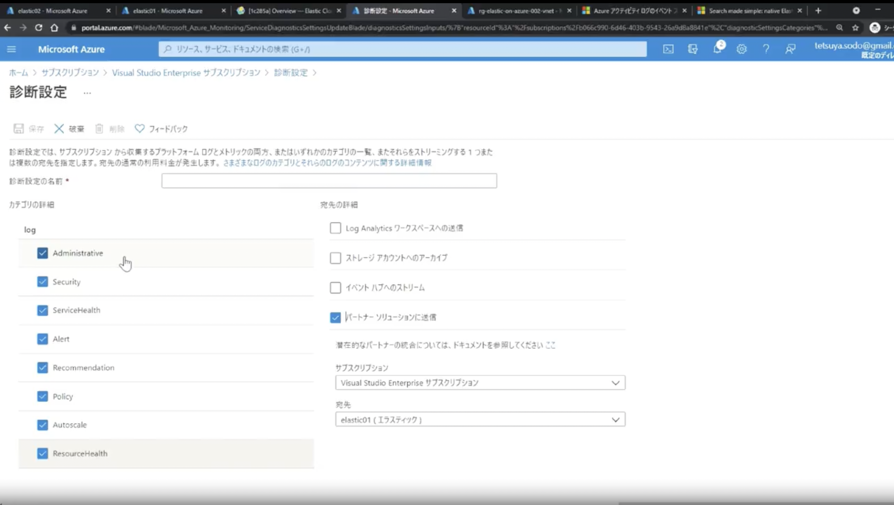
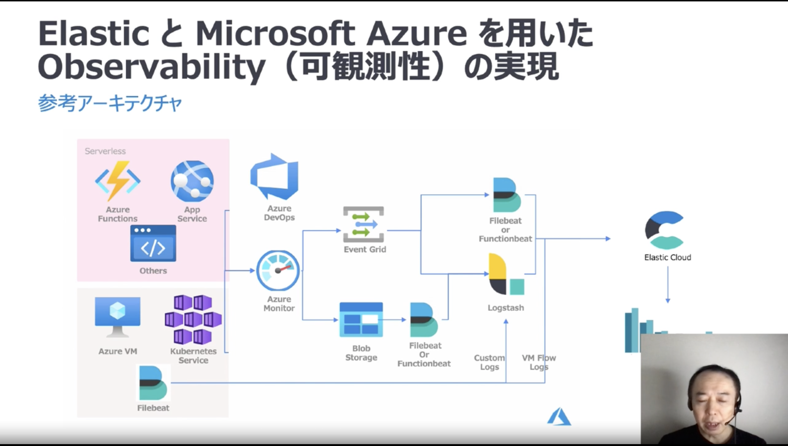

# 2021/07/19　Elastic on Microsoft Azure: インテグレーション強化による価値の創出
## タイトル
Elastic on Microsoft Azure: インテグレーション強化による価値の創出  
 

## サイト
https://www.elastic.co/jp/webinars/elastic-on-microsoft-azure-accelerate-time-to-value-with-enhanced-integration/?view=1  
 

## 主催者
- 鈴木 章太郎  
- 惣道 哲也  
 

## 内容
- Elastic on Azureのメリット  
  - AzureコンソールとElasticコンソール間のSSOサポート  
  - Azure Private Linkをサポート  
- ブログ  
  - Search made simple: native Elastic integration with Azure - now on preview  
- Elastic on Azureハンズオン
  - AzureのさまざまなメトリックをElasticに送信する設定がGUIで可能  
    
  - VMのメトリックを収集したい場合は、VMにElasticのエクステンションをインストールする  
- Elastic on Azureの構成（参考）  
    
